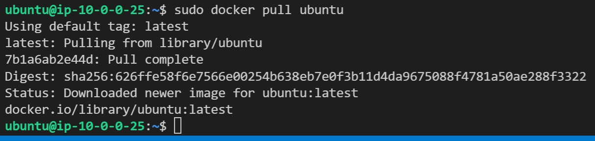
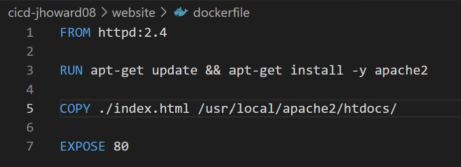

# Project_06 - CICD
----------------------------------
1. Get the Github repository.
* In Pilot, there is a link to go to. It looks like the one below:

* Once attached to the repo, choose the medium in which the user will complete the website.
  I have chosen to use my first instance from lab_01 since WSL gives errors about docker.io.
2. Clone the NEW repo.
* Below is the screenshot from my repo clone.

----------------------------------
3. Get Docker
* Now, one thing to do is to login to the instance which is self explanitory by now. Next the
  user will have to install docker and docker.io. Docker is the program and docker.io allows 
  the uplink to the docker repository for the images to download. . . (I THINK?!?).

* It is always best to make sure that any executable or serivce is running after installation.

----------------------------------
4. Get a webpage or splashpage
* Create a basic HTML file to replace the old "index.html" file that apache2 makes in "/var/www/html"

----------------------------------
5. Pull an image and build.
* From what I know about building an image, you usually need some type of base to lay the rest
  on. This is usually a OS like Ubuntu or a different flavor, but we are going to use "httpd".
  
* Now the DOCKERFILE. . .The dockerfile is basically a list of commands that will build the image
  of whatever you need the container to do. It can look like the one below:
  
* I am using Apache2 so I needed to move the index.html file to index.html.old, and in my dockerfile it
  should copy the web1.html into "/var/www/html/" after installing Apache2.
* Below is the readout:

----------------------------------
6. Run the container.
* After a successful build, use the "sudo docker image ls" to verify that the image is actually there.

* Now that it is verified, we can test to see if the image actually does what we need it to do.
* I had issues trying to run the command below due to login issues with Docker, so I went ahead and 
  logged in using "sudo docker login", input my username and password, then ran the command below.
  Using "sudo docker run -d -p 80:80 web1"